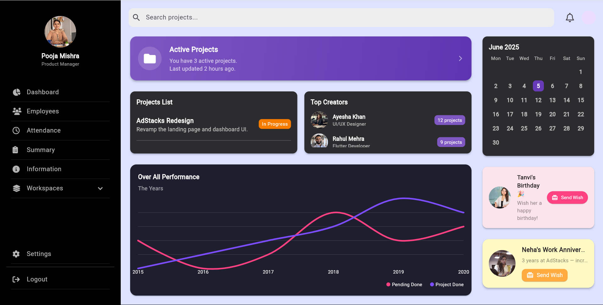
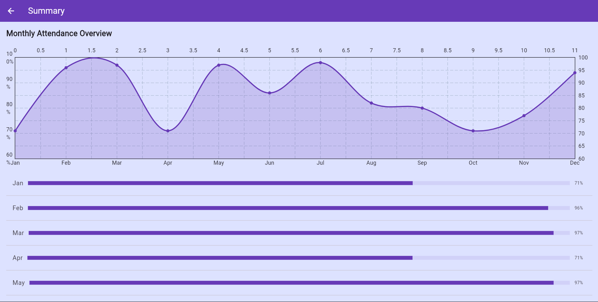
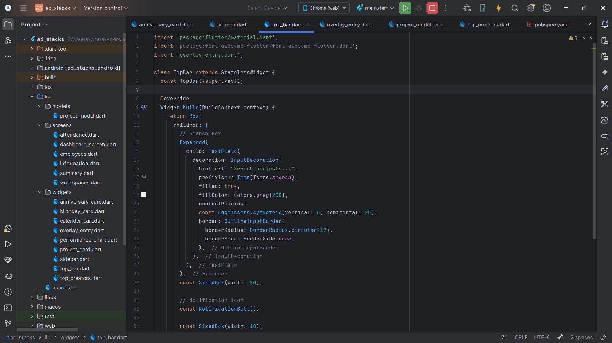

# 🧭 AdStacks – Dark-Themed Admin Dashboard UI (Flutter)

AdStacks is a sleek, dark-themed **admin dashboard UI** built with Flutter. Designed for performance and modern aesthetics, it includes intuitive navigation, data-driven components, and a responsive layout—perfect for enterprise dashboards, internal tools, and SaaS backends.

Whether you’re building internal tools or client-facing SaaS platforms, AdStacks provides a solid, customizable foundation with modern UI patterns and smooth animations.

---

## ✨ Features

- 🎨 Elegant **Dark UI** powered by Material 3  
- 🧭 Sidebar navigation with active route highlighting  
- 📊 Dashboard cards for **project metrics**, **notifications**, and **top creators**  
- 📅 Attendance and employee management views  
- 🗂️ Workspaces section with **subcategories** (AdStacks, Finance)  
- 📈 Integrated **line chart** for visual stats using [`fl_chart`](https://pub.dev/packages/fl_chart)  
- 🔔 Notification pop-up on bell icon with dismiss-on-tap logic  
- 🔁 Fully responsive layout ready for web and desktop  
- ⚙️ Easily customizable components and theming  
- 📱 Supports multiple screen sizes and platforms  

---

## 📸 Preview

| Dashboard Section     | Summary Section      | Code-Snippet     |
|-----------------------|---------------------------|--------------------------|
|  |  |  |

> 💡 *Dark theme is consistent across all views for a modern and minimal UI experience.*

---

## ⚙️ Tech Stack

| Tool/Library            | Purpose                              |
|-------------------------|------------------------------------|
| [Flutter](https://flutter.dev) | Cross-platform UI development      |
| [`fl_chart`](https://pub.dev/packages/fl_chart) | Interactive data visualizations   |
| [`font_awesome_flutter`](https://pub.dev/packages/font_awesome_flutter) | Icon pack for UI elements         |
| [Google Fonts - Poppins](https://fonts.google.com/specimen/Poppins) | Typography styling                |
| Navigator.pushNamed     | Named route navigation               |

---

---

## 📞 Contact & 🤝 Contributing

### Contact

Feel free to reach out if you want to collaborate or have questions:

- **Email:** [bharadwajrudra08@gmail.com](mailto:bharadwajrudra08@gmail.com)  
- **LinkedIn:** [https://www.linkedin.com/in/rudra-bharadwaj-ba6117265/](https://www.linkedin.com/in/rudra-bharadwaj-ba6117265/)  

### Contributing

Contributions are welcome! Please open an issue or submit a pull request for improvements or bug fixes. Your feedback and help make this project better.

---


## 🏁 Getting Started


### 🔧 Prerequisites

- Flutter SDK (>= 3.22)  
- Dart SDK (>= 3.x)  
- Any IDE with Flutter support (VSCode, Android Studio, IntelliJ)

### 🚀 Run the Project

```bash
git clone https://github.com/yourusername/adstacks_dashboard.git
cd adstacks_dashboard
flutter pub get
flutter run -d chrome

---


